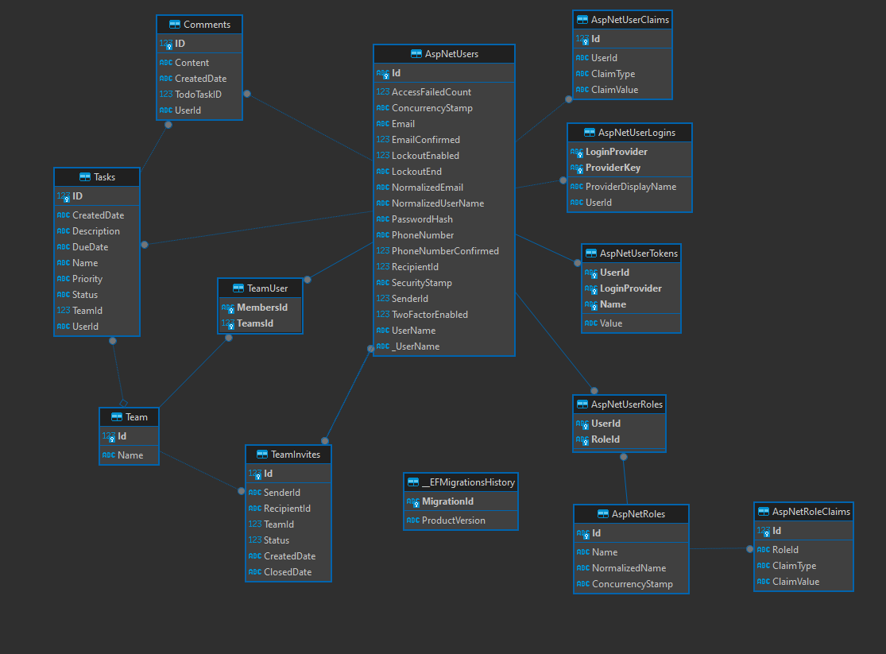

# TaskNinja

## About:

Demo app, capable of storing todo tasks, managing users and assigning them to teams. Tasks can be either personal (no team assigned) or assigned to a team, in which case all team members can see/edit them. Each task has section for comments.

New members can be invited to a team by sending them invitation, which can be accepted/declined. Invite is sent based on e-mail address.

App does not require email verification (any string that looks like e-mail address is accepted as valid email address.)

## Tech:

- RazorPages, bootstrap5

- EFCore with LINQ, SQLite db

- ASP.NET Identity for authentication/authorization

## Database diagram:

## UI:

